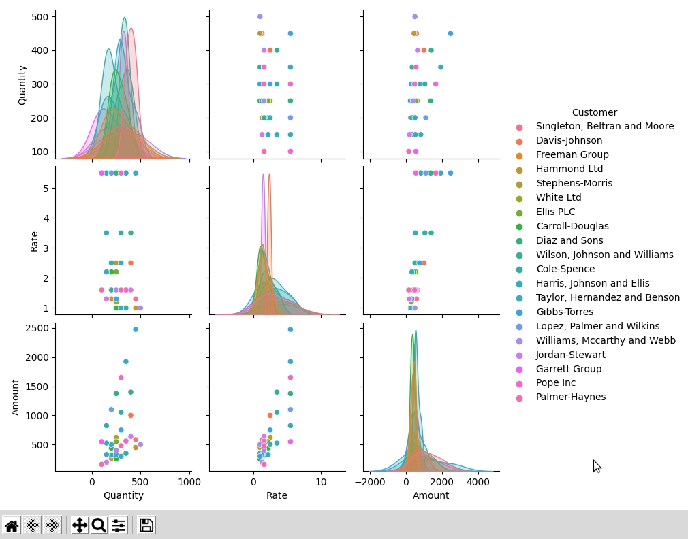

# ML-for-Accounting
My main motivation in this course to introduce ML with supervised and unsupervised learning algo and make custom app for ERPNext Accounting or perhaps contribute it into ERPNext.

To Run Data Exploration.py. First Need to install all python packages like pandas, numpy, matplotlib and SNS(optional)

$ pip install pandas
$ pip install matplotlib
$ pip install seaborn

UPDATE:
I tried to look for result in Item Wise Sales History from Demo.

I added sample for Item_wise_sales_history.csv
and result we got for same is 

